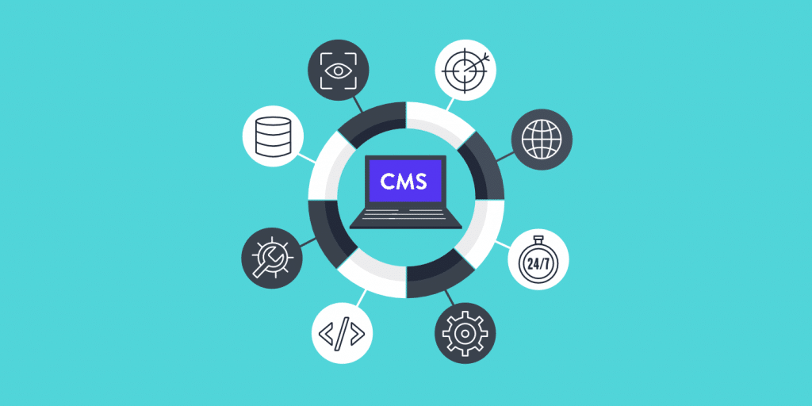

<div align="center">
  
<h1 align="center">goCMS</h1>



<hr />

<p style="margin-bottom: 8px;">

goCMS is a headless CMS (Content Management System) written in Golang using Gin framework + </>Htmx & A-H Templ, designed to be fast, efficient, and easily extensible. It allows you to create a website or blog, with any template you like, in only a few commands.

</p>
  
 

</div>

<hr />

## Features 🚀

- [x] **Headless Architecture:** Adding pages, posts, or forms should all
  be done with easy requests to the API.
- [x] **Golang-Powered:** Leverage the performance and safety of one of the
  best languages in the market for backend development.
- [x] **SQL Database Integration:** Store your posts and pages in SQL databases for reliable and scalable data storage.
- [x] **Centralized HTTP error handling:** The user receives feedback about the Http errors that their actions may cause, through the use of middleware that centralizes the Http errors that occur.
- [x] **Caching HTML responses from endpoints:** Own implementation of an in-memory cache that stores HTML responses for 10 minutes in a map with mutex lock R/W access.
- [x] **Live Reload:** through the use of `air`.
- [x] **Possibility for the user to add their own plugins written in `Lua`:** this feature allows you to customize the admin application at runtime.
- [ ] **Post**: We can add, update, and delete posts. Posts can be served
  through a unique URL.
- [ ] **Pages**: TODO.
- [ ] **Menus**: TODO
  
<br />

>[!IMPORTANT]
>***The Go language uses [html/template](https://pkg.go.dev/html/template) package to render HTML. In this application we have used the [a-h/templ](https://github.com/a-h/templ) library instead. The main difference is that templ uses a generation step to compile the files .templ into Go code (as functions). This means that the templates are type-safe and can be checked at compile time. This amazing library implements a templating language (very similar to JSX) which allows you to write code almost identical to Go (with expressions, control flow, if/else, for loops, etc.) and have autocompletion. For all these reasons, calling these templates from the controllers side will always require the correct data, minimizing errors and thus increasing the security and speed of our coding.***

## Installation

Ensure you have Golang installed on your system before proceeding with the installation.

```bash
go get -u github.com/emarifer/gocms
```

### Example - Running the App (user application)

First, make sure you have the necessary executable binaries to run and work with the application.
```bash
make install-tools
```

After that, with the `MariaDB` database engine running, make sure to run the migrations with the previously installed `Goose` tool. We recommend creating a database called `cms_db` and running the following command:

```bash
GOOSE_DRIVER="mysql" GOOSE_DBSTRING="root:root@/gocms" goose up
```
Replace the database connection string with the appropriate string
dependending on where your database is.

After you've replaced the default template files with your prefered
template, simply build and start the app with the following commands.

```bash
go mod tidy && go build -ldflags="-s -w" -v -o ./tmp/gocms ./cmd/gocms && ./tmp/gocms
```

This will start `goCMS` on `http://localhost:8080`. You can customize
the configuration by providing the necessary environment variables.

For more information, see the [configuration settings](#configuration).

### Example - Running with Docker Compose (user & admin applications)

In this case the only requirement is to have `Docker` installed and running.

To create the image and the `Docker` containers and start the application you only need to run the following command in the project folder:

```bash
make run-containers
```
The above will create an Ubuntu:jammy image and, within that OS, will install Golang, Goose, A-H.Templ and Air. Next, from said image and the mariadb:jammy image, you will create and start two containers: one containing the `goCMS` app, serving on port `8080`, and another one serving the `mariadb` database internally (although it also exposes port 3306 to the outside of the container). This will also run the migrations automatically to setup the database!

To stop and eliminate both containers we will execute the following in another terminal:

```bash
docker compose down # to stop and remove containers (run in another terminal)
```

If we do not plan to delete the containers with the idea of continuing to reuse them, we will simply press `Ctrl+C` in the same terminal. This will stop the containers without deleting them. The next time we want to start the application we will run `make run-containers` again.

Whenever we have created/executed the aforementioned containers, the executable file of the admin application will have been created. To start it (outside of `Docker`), simply run the command:

```bash
make run
```

The above takes the environment variables that have been added by default in the Makefile, but we can add the environment variables we need if we pass them to the command:

```bash
./tmp/gocms-admin # e.g. DATABASE_PORT=3306 ./tmp/gocms-admin
```

>[!IMPORTANT]
>***Although the administration application takes the environment variables supplied by the admin related to the listening port and the database, it is also necessary to supply another environment variable related to a `.toml` settings file that specifies the plugins that the application will use:***

```bash
# e.g.

DATABASE_PORT=3306 CONFIG_FILE_PATH="settings/gocms_config.toml" ./tmp/gocms-admin
```

```bash
# .toml settings file

[[shortcodes]]
name = "img"
# must have function "HandleShortcode(arguments []string) -> string"
plugin = "plugins/image_shortcode.lua"
```

## Architecture

Currently, the architecture of `goCMS` is still in its early days.
The plan is to have two main applications: the public facing application
to serve the content through a website, and the admin application that
can be hidden, where users can modify the settings, add posts, pages, etc.

## Configuration

The runtime configuration is handled through reading the
necessary environment variables. This approach was chosen as
it makes integrating `envfile`s quite easy.

The following list outlines the environment variables needed.

- `GIN_MODE`: `release` for production,
- `WEBSERVER_PORT`: port from which the application is served, e.g. `8080`.
- `DATABASE_HOST` should contain the database address, e.g. `localhost`.
- `DATABASE_PORT` should be the connection port to the database. For example `3306`.
- `DATABASE_USER` is the database username.
- `DATABASE_PASSWORD` needs to contain the database password for the given user.
- `IMAGE_DIRECTORY` indicates the absolute path to the `media` folder on your system.

## License

`goCMS` is released under the MIT License. See LICENSE for
details. Feel free to fork, modify, and use it in your projects!

---

## Happy coding 😀!!